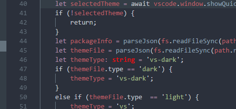

# Contributing

## Reporting Bugs/Providing Suggestions

If you see any weird theming issues or have any suggestions please open an issue with a screenshot of the problem or suggestion.

For example in the following image the type `string` is colored incorrectly.

## Testing and Building

I am currently testing this extension with node v7.4.0.

### Setup Builder

1. Clone [https://github.com/obahareth/base16-builder-ruby](https://github.com/obahareth/base16-builder-ruby). Then run `./builder update`. This should be temporary until I create a node-typescript builder.
2. Edit `sources/templates/list.yaml` to only include one entry. This is because we really only want to build themes for vscode but the ruby builder needs at least one entry in the templates file.
3. Create a `vscode` directory in `templates`.
4. Copy the `builder/templates` folder from this repository into the `vscode` directory.
5. Delete any template folders in `templates` that do not need to be built, this will probably include the one entry you left in the templates file from earlier.

### Generate Themes

1. Run the debugger for this extension in VSCode to create the scripts. They will be located in `out/src/scripts`.

> Tip: Create a backup of the `schemes` directory created by the builder before running the next step. This makes it easy to revert changes. 

2. Run `node /path/to/base16-generator/out/src/scripts/generate-light-schemes.js` inside the `schemes` directory created by the builder. This script will generate light versions of schemes from dark version of schemes as well as making sure the scheme title contains Light or Dark as needed.
3. Now in the root of the base16 builder directory run `./builder`. This will create the themes from the generated schemes inside `out/themes`.
4. Copy the generated themes to `/path/to/base16-generator/themes`.
5. Now run `node /path/to/base16-generator/out/src/scripts/finish-theme.js` inside the `themes` directory.

### Testing Theme Changes

#### Things To Look At
[VSCode Theme Color Reference](https://code.visualstudio.com/docs/getstarted/theme-color-reference)  
[Base16 Website](http://chriskempson.com/projects/base16/)  
[Base16 Theme Examples](https://chriskempson.github.io/base16/)  
[Base16 Repository](https://chriskempson.github.io/base16/)  

1. Modify `reference-theme/base16-ocean-dark.json` using the colors from Base16 Ocean. Make sure to update the comments as necessary.
2. Copy `reference-theme/base16-ocean-dark.json` into the `themes` directory and debug the extension to make sure the changes have the desired effect.
3. Repeat 1 and 2 until you are ready to publish your changes.
4. Modify `builder/templates/vscode/templates/default.mustache` to reflect the changes made in `reference-theme/base16-ocean-dark.json`. Follow the template hex variables found [here](https://github.com/chriskempson/base16/blob/master/builder.md#template-variables).
5. Copy `builder/templates/vscode/templates/default.mustache` to `/path/to/base16-builder/templates/vscode/templates/` (see step 4 from [Setup Builder](#Setup-Builder).
6. Follow the rest of the steps in Setup Builder and Generate Themes.